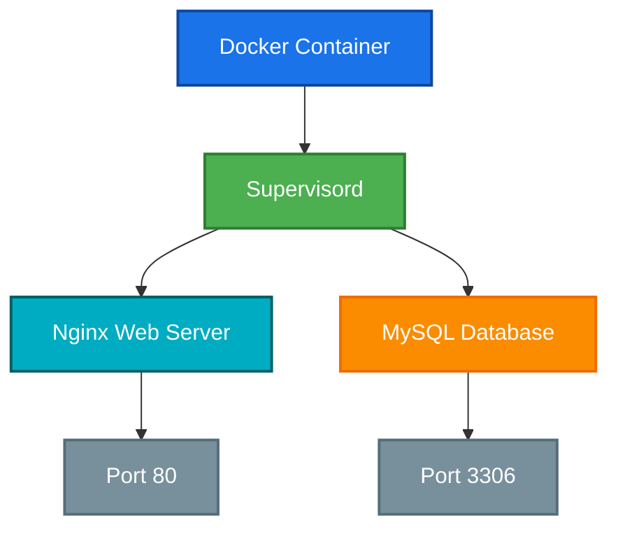

# 🐳 Docker Host-Like Environment

[](https://github.com/TheToriqul/docker-host-like-env)
[](https://github.com/TheToriqul/docker-host-like-env/stargazers)


## 📋 Overview

This project demonstrates my journey in creating a sophisticated Docker container environment that mimics a traditional host setup. Through this implementation, I've developed a deep understanding of containerization principles and multi-service orchestration using Docker. The environment runs multiple services (Nginx, MySQL) managed by Supervisord, showcasing practical containerization skills in a real-world scenario.

## 🏗 Technical Architecture

The project implements a layered architecture where multiple services coexist within a single container, managed by Supervisord as the process manager.



## 💻 Technical Stack

- **Base System**: Ubuntu Latest
- **Process Manager**: Supervisord
- **Web Server**: Nginx
- **Database**: MySQL Server
- **Container Runtime**: Docker

## ⭐ Key Features

1. Multi-Service Container Management
   - Supervisord process orchestration
   - Automated service recovery
   - Unified logging system

2. Web Server Configuration
   - Nginx server setup
   - Static content serving
   - Custom configuration capability

3. Database Implementation
   - MySQL server integration
   - Persistent storage support
   - Secure default configuration

4. Process Management
   - Service health monitoring
   - Automatic restart capabilities
   - Process isolation

5. Networking
   - Port mapping and exposure
   - Inter-service communication
   - Network isolation

6. Logging and Monitoring
   - Centralized logging
   - Service status monitoring
   - Debug capabilities

## 📚 Learning Journey

### Technical Mastery:

1. Docker container lifecycle management
2. Multi-process containerization patterns
3. Service orchestration with Supervisord
4. Container networking principles
5. Docker image optimization techniques

### Professional Development:

1. System architecture design
2. Service reliability engineering
3. Documentation best practices
4. Problem-solving methodology
5. Infrastructure as Code principles

## 🔄 Future Enhancements

<details>
<summary>View Planned Improvements</summary>

1. Implement container health checks
2. Add Redis caching layer
3. Enhance logging with ELK stack
4. Implement automated backups
5. Add monitoring with Prometheus
6. Develop CI/CD pipeline integration
</details>

## ⚙️ Installation

<details>
<summary>View Installation Details</summary>

### Prerequisites

- Docker Engine installed
- Git for repository cloning
- 4GB RAM minimum
- 10GB free disk space

### Setup Steps

1. Clone the repository:
```bash
git clone https://github.com/TheToriqul/docker-host-like-env.git
cd docker-host-like-env
```

2. Build the Docker image:
```bash
docker build -t my_host_like_env .
```

3. Run the container:
```bash
docker run -d --name my_container -p 80:80 -p 3306:3306 my_host_like_env
```

### Configuration

```env
MYSQL_ROOT_PASSWORD=your_secure_password
NGINX_PORT=80
MYSQL_PORT=3306
```

</details>

## 📫 Contact

- 📧 Email: toriqul.int@gmail.com
- 📱 Phone: +65 8936 7705, +8801765 939006

## 🔗 Project Links

- [GitHub Repository](https://github.com/TheToriqul/docker-host-like-env)
- [Documentation](https://github.com/TheToriqul/docker-host-like-env/wiki)

## 👏 Acknowledgments

- [Poridhi for excellent labs](https://poridhi.io/)
- Docker community for extensive documentation
- Open source contributors for inspiration

---

Feel free to explore, modify, and build upon this configuration as part of my learning journey. You're also welcome to learn from it, and I wish you the best of luck!